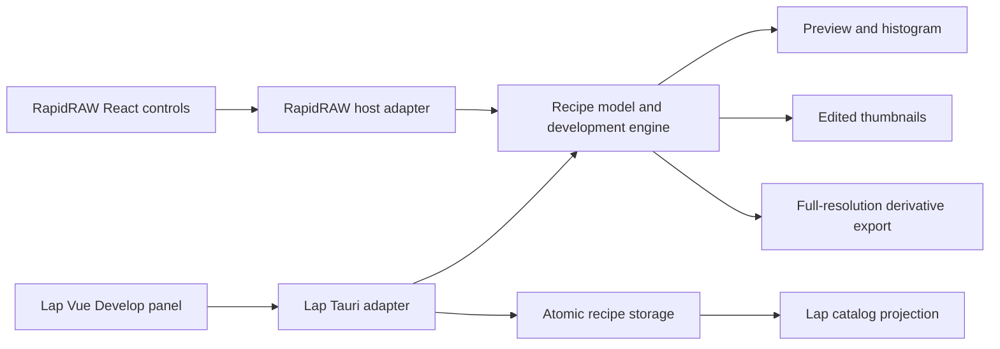

# Reusable RapidRAW development engine for Lap

## 1. Outcome

Lap users can select a RAW photo, develop it in the main window's right panel,
leave it, restart Lap, and continue editing without changing the source image.
Library previews and exported derivatives reflect the saved recipe. Lap retains
ownership of cataloging, search, ratings, collections, and file operations.

**Recommendation:** extract RapidRAW's recipe model and Rust processing engine;
implement native Vue controls in Lap. Treat this as an editing subsystem
integration, not a React panel transplant.

This is an analysis and proposed specification, not an implementation or a claim
of image-quality parity. Source inspection on 2026-09-26 used:

- RapidRAW working tree, initially clean, at
  `5e30bcbb246395d391ba2e9662510641ffe68e6b`.
- [weholt/lap](https://github.com/weholt/lap/tree/67cda34420587dd3590a7e63cb008e55b0f9acb1),
  freshly cloned default branch at `67cda34420587dd3590a7e63cb008e55b0f9acb1`.
  A separate existing local Lap checkout was discovered at `be6a111`; it was not
  modified. Implementation must reconcile its branch with the inspected revision.

## 2. Scope

The first useful release includes persistent global development: exposure and
tone, white balance, color/HSL, curves, detail controls, grain/vignette, crop,
rotate/flip, histogram, before/after, reset, session undo/redo, and full-resolution
export. LUTs, reusable presets, and selective copy/paste follow on the same model.
Masks, lens corrections, and virtual copies are subsequent increments.

Generative editing, AI segmentation/depth blur, AI denoising, HDR merging,
panorama/focus stacking, tethering, community accounts, and export scripts are
outside the initial extraction. Their dependency footprint must not become a
requirement for ordinary RAW editing.

### What exists and where to separate it

| Concern            | RapidRAW evidence                                                                                                                                                                                                  | Lap evidence and required adaptation                                                                                                                                                                                                                                                                                                                                                   |
| ------------------ | ------------------------------------------------------------------------------------------------------------------------------------------------------------------------------------------------------------------ | -------------------------------------------------------------------------------------------------------------------------------------------------------------------------------------------------------------------------------------------------------------------------------------------------------------------------------------------------------------------------------------- |
| Panel and controls | [ControlsPanel.tsx](src/components/panel/right/ControlsPanel.tsx), [adjustment components](src/components/adjustments), [Slider.tsx](src/components/ui/Slider.tsx)                                                 | Vue/Pinia in [package.json](https://github.com/weholt/lap/blob/67cda34420587dd3590a7e63cb008e55b0f9acb1/src-vite/package.json). Rebuild presentation in Vue; retain parameter meanings and interaction behavior.                                                                                                                                                                       |
| Recipe/defaults    | [adjustments.ts](src/utils/adjustments.ts), `INITIAL_ADJUSTMENTS`, `normalizeLoadedAdjustments`, `ADJUSTMENT_SECTIONS`                                                                                             | Lap's [uiStore.js](https://github.com/weholt/lap/blob/67cda34420587dd3590a7e63cb008e55b0f9acb1/src-vite/src/stores/uiStore.js) holds one temporary `activeAdjustments` object, not a durable per-photo recipe.                                                                                                                                                                         |
| Edit session       | [useEditorStore.ts](src/store/useEditorStore.ts), [useEditorActions.ts](src/hooks/useEditorActions.ts), [useImageLoader.ts](src/hooks/useImageLoader.ts), [useImageProcessing.ts](src/hooks/useImageProcessing.ts) | Replace temporary state with an asset-scoped session and persistence acknowledgments; keep Vue/Pinia in Lap.                                                                                                                                                                                                                                                                           |
| RAW decode         | [raw_processing.rs](src-tauri/src/raw_processing.rs), [image_loader.rs](src-tauri/src/image_loader.rs)                                                                                                             | RapidRAW uses its `rawler` fork and floating-point development. Lap's [libraw_shim.cpp](https://github.com/weholt/lap/blob/67cda34420587dd3590a7e63cb008e55b0f9acb1/src-tauri/src/libraw_shim.cpp) requests 8-bit processed output; [t_libraw.rs](https://github.com/weholt/lap/blob/67cda34420587dd3590a7e63cb008e55b0f9acb1/src-tauri/src/t_libraw.rs) renders a 4096-pixel preview. |
| Adjust/render      | [image_processing.rs](src-tauri/src/image_processing.rs), [gpu_processing.rs](src-tauri/src/gpu_processing.rs), [WGSL shaders](src-tauri/src/shaders), [adjustment_utils.rs](src-tauri/src/adjustment_utils.rs)    | Lap's [ImageEditor.vue](https://github.com/weholt/lap/blob/67cda34420587dd3590a7e63cb008e55b0f9acb1/src-vite/src/views/ImageEditor.vue) uses CSS filters; [t_image.rs](https://github.com/weholt/lap/blob/67cda34420587dd3590a7e63cb008e55b0f9acb1/src-tauri/src/t_image.rs) applies corresponding raster operations on save. Replace both paths for developed assets.                 |
| Storage            | [ImageMetadata](src-tauri/src/image_processing.rs), [load_sidecar](src-tauri/src/exif_processing.rs), [file_management.rs](src-tauri/src/file_management.rs)                                                       | RapidRAW writes `filename.ext.rrdata`; Lap needs durable recipe storage plus a catalog projection and sidecar-aware file operations.                                                                                                                                                                                                                                                   |
| Export             | [export_processing.rs](src-tauri/src/export_processing.rs), especially `process_image_for_export_pipeline`                                                                                                         | Lap's `get_edited_image` loads generated previews for RAW; develop originals at full resolution instead. Keep format encoding and catalog registration in Lap adapters.                                                                                                                                                                                                                |
| Related resources  | [lut_processing.rs](src-tauri/src/lut_processing.rs), [mask_generation.rs](src-tauri/src/mask_generation.rs), [lens_correction.rs](src-tauri/src/lens_correction.rs), [usePresets.ts](src/hooks/usePresets.ts)     | Extract after core contracts; LUTs, mask bitmaps, and lens profiles need durable resource identities, packaging, and versioning.                                                                                                                                                                                                                                                       |

### Important limitations in the source

- `ControlsPanel` directly reads editor/settings/UI stores and context menus.
  Several child controls already accept values and callbacks, but effects and LUT
  controls also invoke backend services. This is a useful conceptual component
  boundary, not a framework-independent package today.
- `Adjustments` imports UI types, has an `any` index signature, and mixes rendering
  data with presentation state. Rust primarily consumes `serde_json::Value`.
  `ImageMetadata.version` defaults to 1; this does not by itself provide a
  validated, versioned adjustment schema or migrations.
- `sectionVisibility` affects rendering in `image_processing.rs`; preserve it as
  section enable/bypass state. Accordion expansion, clipping overlays, hover
  previews, and processing flags belong in session/UI state instead.
- Rust `AppState` combines one loaded original, preview workers, GPU caches, AI,
  export workflows, and application services. `apply_adjustments` takes no asset
  or session identifier. Copying this singleton into Lap would be unsuitable for
  independent viewer windows and competing render jobs.
- `GpuContext` contains an optional native `WgpuDisplay`; GPU initialization also
  handles window integration. Separate offscreen compute from presentation.
- `.rrdata` saves use direct `fs::write`; `load_sidecar` returns default metadata
  for unreadable or malformed files. These paths do not establish crash-safe
  persistence or protect a damaged recipe against replacement by defaults.
- RapidRAW debounces saves and flushes on several navigation paths. Its undo
  stack holds up to 50 states in memory and resets when loading another photo.
  Persisted edits do **not** mean persisted undo history.
- RAW interpretation includes global settings such as highlight compression,
  linear RAW mode, and tone-mapper overrides. A portable recipe must capture
  effective rendering settings, not depend on the current application's defaults.
- `process_and_get_dynamic_image_inner` returns the unprocessed base image when
  dimensions exceed GPU texture limits. This cannot be an accepted success path
  for edited export. Existing CPU helpers do not establish complete CPU parity.

## 3. Decisions

The following are proposed implementation decisions. They are not already present
in either application.

### Module boundaries and ownership

Start as internal crates in RapidRAW, then consume a pinned release/revision from
Lap. Keep RapidRAW using the same extracted implementation before porting the
complete UI. Choose a standalone shared repository only after these interfaces
work in both hosts; avoid maintaining two copied processing pipelines.

| Proposed module                        | Responsibility                                                                                                                                               | Excluded dependencies                                                                    |
| -------------------------------------- | ------------------------------------------------------------------------------------------------------------------------------------------------------------ | ---------------------------------------------------------------------------------------- |
| `rapidraw-edit-model`                  | Validated recipe, defaults, migrations, canonical serialization/hash, parameter descriptors, geometry and resource references; generated TypeScript contract | React, Vue, Tauri, catalog, filesystem policy                                            |
| `rapidraw-develop`                     | Decode, linear image buffers, ordered transformations, adjustment math/WGSL, offscreen GPU rendering, histogram, cancellation and capability reporting       | Application window handles, app settings stores, dialogs, AI downloads, library indexing |
| Host session adapters                  | Asset lookup, bounded session caches, preview scheduling, IPC, progress, preview transport, lifetime management                                              | Application-global implicit image selection                                              |
| Lap recipe repository                  | Atomic sidecar writes, revision checks, catalog projection, resource storage, recovery and file-operation integration                                        | Encoding edited pixels into source images                                                |
| Lap `DevelopPanel.vue` and composables | Native controls, interaction transactions, save status, preview display, undo/redo                                                                           | React runtime or CSS adjustment math                                                     |

Use a decoder abstraction, initially implemented with RapidRAW's existing
`rawler` path to minimize changes to its image appearance. Keep Lap's LibRaw
browsing support for unedited assets. A future LibRaw development adapter must
produce equivalent linear, high-precision inputs and pass the same fixtures;
converting an already clipped 8-bit preview to float is insufficient.

The compute extraction must also untangle smaller dependencies, including RAW
orientation helpers, `multi_exposure::neutralize_wb_if_multiexposure`, mask/cache
types, LUT resolution, geometry, and lens-blur calls. This is more than moving
`gpu_processing.rs` into a crate. Remove unused optional subsystems from the
initial build dependency graph rather than merely hiding their buttons.

### Recipe and session contract

Use one validated schema, generating TypeScript types/default fixtures from the
same source. Preserve RapidRAW's numeric semantics initially; Lap's current
saturation default of 100 is not RapidRAW's default of 0. Do not map fields by
name alone. Validate finite numbers, bounds, curves, masks, and resource sizes.

The durable envelope contains `schemaVersion`, `engineVersion`, `assetId`,
`variantId`, `revision`, source fingerprint, effective RAW/decode/color settings,
the adjustment recipe, and resource hashes. Define geometry in a documented
oriented coordinate system, with explicit conversions from existing pixel crops.
Persist operation order, section bypasses, and effect parameters. Keep zoom,
clipping display, selected tool, hover presets, and drag state outside the recipe.

Proposed host operations:

- `open_edit_session(assetId, variantId)` returns a session ID, source identity,
  current recipe/revision, dimensions, and supported capabilities.
- `render_preview(sessionId, generation, recipe, viewport, quality)` returns
  matching session/generation metadata, pixels or an asset handle, and analytics.
- `commit_recipe(sessionId, expectedRevision, recipe)` validates and persists,
  returning the durable revision. Serialize writes per asset/variant and reject
  stale revisions across windows.
- `export_developed(assetId, variantId, revision, destination, settings)` renders
  an immutable committed recipe from the original. The UI flushes edits first.
- `close_edit_session` releases resources after pending saves settle; canceling
  preview work must not cancel an acknowledged save.

Use bounded buffers/asset transport for previews, not large base64 JSON payloads.
Start with offscreen GPU rendering into Lap's existing image display. A native
GPU surface can be optimized later; porting RapidRAW's window composition is not
a prerequisite for correctness. Coalesce preview requests and ignore stale
responses by both session ID and generation. Keep export jobs separate from the
interactive queue, with explicit memory limits and cancellation.

### Persistence and compatibility

Recommended first-release storage is an authoritative adjacent
`filename.ext.lapedit.json` sidecar. SQLite stores a rebuildable projection:
asset/file association, variant, revision, edited flag, and preview/cache identity.
This keeps development instructions portable and recoverable after a catalog
rebuild. Lap's ratings/tags/collections keep their existing ownership.

Write a temporary sibling file, flush it, atomically replace the previous version
using tested platform behavior, then acknowledge success and update the catalog.
Retain a recoverable previous revision. Reconcile sidecar-ahead-of-catalog state
on restart; never acknowledge a save solely because Pinia or a thumbnail changed.
Debounce saves per asset, await them on navigation/close, and show saving, saved,
conflict, or failed status. A failed save retains the dirty session for retry.

For the initial scope, a read-only source directory produces an explicit save
failure with an option to retain/retry the session or work from a writable copy.
A managed recipe store for read-only/network libraries is a future extension,
not an implicit second authority. This writable-sidecar assumption should be
confirmed before implementation if such libraries are required immediately.

Import existing `.rrdata` through an explicit compatibility reader. Leave the
original sidecar untouched; write Lap's envelope only after validation. Preserve
the original payload for diagnostics/forward compatibility. Unsupported visible
effects or missing LUT/mask resources block a claim of faithful import/export;
do not silently drop them. Initial import supports only the implemented subset.
Two-way `.rrdata` interoperability is a separate milestone.

File operations treat recipes/resources as associated assets. Rename/move keeps
identity; copy creates a new asset identity with the same initial recipe; trash
and restore keep the group together. Resolve RAW/JPEG pairs to the explicitly
selected RAW member; never attach its recipe to whichever companion is displayed.
Fingerprint checks detect replacement at the same path. External moves require
reconciliation and ambiguity handling, not a promise that a path or catalog row
ID is globally stable.

### Lap integration points

The inspected Lap revision places the basic adjustment sliders in the separate
`ImageEditor.vue` window. The main right panel in
[`Content.vue`](https://github.com/weholt/lap/blob/67cda34420587dd3590a7e63cb008e55b0f9acb1/src-vite/src/components/Content.vue)
switches among information, selection, and duplicate review. Interpret the
requested destination as an explicit **Develop** mode in this main right panel,
beside information, with the central filmstrip/preview showing the rendered image.
Keep selection and duplicate workflows usable. Reuse the same Vue development
components if the separate editor window remains supported.

Replace the current development save semantics in all entry points:

- `ImageEditor.vue`: replace CSS filters and `editImage` calls for developed
  assets; retain useful layout/geometry interaction code after coordinate tests.
- [`FileInfo.vue`](https://github.com/weholt/lap/blob/67cda34420587dd3590a7e63cb008e55b0f9acb1/src-vite/src/components/FileInfo.vue):
  its `quickSave` builds a request with identical source/destination paths.
  Route development commits to recipe storage, never this pixel-writing path.
- `Content.vue`: replace the development-related `checkUnsavedChanges`/quick-save
  path with awaited recipe commits. Add edited status and revision notifications.
- `MediaViewer.vue`, `ImageViewer.vue`, thumbnail retrieval/cache code: prefer
  the developed derivative when a recipe exists, with an explicit original view.
  Keep cache keys sensitive to source fingerprint, recipe/resource hash,
  engine/color version, dimensions, and quality tier.
- [`ImageHistogram.vue`](https://github.com/weholt/lap/blob/67cda34420587dd3590a7e63cb008e55b0f9acb1/src-vite/src/components/ImageHistogram.vue):
  accept renderer analytics or rendered pixels. Its current simulated filter
  calculation must not apply the adjustments a second time.
- [`t_cmds.rs`](https://github.com/weholt/lap/blob/67cda34420587dd3590a7e63cb008e55b0f9acb1/src-tauri/src/t_cmds.rs),
  `t_sqlite.rs`, `t_migration.rs`, and existing grouped-asset operations: add recipe
  projection/migrations and extend move/copy/rename/trash/reindex behavior.

Editing autosaves instructions; **Export** explicitly creates a derivative at a
different destination. Enforce source protection in Rust, including normalized
path/alias checks, not only by hiding an overwrite button. Existing JPEG/PNG
derivatives cannot be inverted into prior RAW recipes.

### Alternatives and constraints

Embedding React inside Vue could preserve some widgets but retains two state and
UI systems without solving decode, storage, export, or catalog integration.
An external RapidRAW editor round trip is a possible interim workflow, but does
not satisfy editing inside Lap's right panel. Reimplementing all adjustment math
in Lap creates a second renderer and a continuing parity burden.

RapidRAW's [LICENSE](LICENSE) is AGPL-3.0; Lap's inspected package manifests
declare GPL-3.0-or-later. Record provenance and obtain a distribution/license
decision for the combined code before shipping. Audit shaders, `rawler`, bundled
film LUTs, lens data, and optional models separately. This analysis does not
determine the resulting distribution obligations.

## 4. Prerequisites

Statuses describe evidence for planning, not implementation completion.

| ID  | Consumer              | Required result                                                                                                  | Status  | Evidence                                                                                                            |
| --- | --------------------- | ---------------------------------------------------------------------------------------------------------------- | ------- | ------------------------------------------------------------------------------------------------------------------- |
| P1  | Extraction design     | Inspect both application interfaces                                                                              | ready   | Pinned revisions and source map above                                                                               |
| P2  | Lap implementation    | Select target branch and reconcile local work with inspected main                                                | unknown | Existing local checkout differs from sampled GitHub revision                                                        |
| P3  | Distribution          | License/provenance decision covering code and bundled resources                                                  | unknown | Different declared top-level licenses; no combined-product decision supplied                                        |
| P4  | Renderer verification | Redistributable RAW fixtures covering Bayer, X-Trans, linear DNG, orientation, high highlights, and large images | missing | No suitable editor parity corpus identified in the inspected tests; select cameras relevant to the intended library |
| P5  | Performance/release   | Reference machines and GPU/backend coverage on Windows, Linux, macOS                                             | unknown | No Lap-plus-engine runtime or benchmark measurements made                                                           |
| P6  | Persistence design    | Accept writable adjacent sidecars for first release, or specify managed storage                                  | unknown | Proposed default above; read-only library requirement unspecified                                                   |
| P7  | Build integration     | Reconcile Rust/dependency requirements and packaging                                                             | unknown | RapidRAW pins Rust 1.98 and adds wgpu/rawler; Lap has its own LibRaw/ONNX build and dependency choices              |

The shared crates, typed schema, Lap repository adapter, Vue controls, migrations,
and regression tests are delivery outputs, not existing prerequisites. No network
service, cloud account, or AI provider is required for the initial feature set.

## 5. Acceptance

| ID  | Observable check                                                                                                                                                                                                                                                                                                                                                                          |
| --- | ----------------------------------------------------------------------------------------------------------------------------------------------------------------------------------------------------------------------------------------------------------------------------------------------------------------------------------------------------------------------------------------- |
| A1  | Hash source RAW bytes before editing, restart, reset, and export; hashes stay identical. Backend rejects source/alias export destinations.                                                                                                                                                                                                                                                |
| A2  | Change several adjustments on A, immediately switch to B, close/reopen Lap, and reselect A. The acknowledged recipe and geometry are restored; A's settings never appear on B.                                                                                                                                                                                                            |
| A3  | Inject process termination and write/catalog failures at each save boundary. Last acknowledged sidecar stays readable; startup reconciles catalog lag. Corrupt/future-version recipes and read-only directories produce visible errors without overwriting prior data.                                                                                                                    |
| A4  | Two windows commit from the same revision: one succeeds, the stale commit reports a conflict. Delayed preview/analytics results never overwrite a newer session/generation.                                                                                                                                                                                                               |
| A5  | Render a RAW larger than 4096 pixels. Export uses the original decoded dimensions unless explicitly resized/cropped and reproduces the committed settings after restart. Embedded previews never serve as the development source.                                                                                                                                                         |
| A6  | Against pinned RapidRAW fixture outputs, compare each enabled adjustment and representative combinations before/after extraction. Freeze numeric tolerances per output precision/backend after baseline capture. Compare settled preview to a downsampled export under one color transform; verify histogram corresponds to that rendered state. Requires real RAW fixtures and GPU runs. |
| A7  | Missing adapter, device loss, out-of-memory, oversized textures, and missing resources produce explicit unsupported/failed results or a verified equivalent path. Never report an unadjusted image as a successful adjusted export.                                                                                                                                                       |
| A8  | Rename, move, copy, trash/restore, external rescan, and catalog rebuild preserve or correctly re-associate edits. Test same-basename RAW/JPEG pairs, replacement at a path, Unicode paths, and missing media.                                                                                                                                                                             |
| A9  | Reset, undo/redo, section bypass, crop/orientation, preset preview/cancel, and selective copy/paste behave consistently. Hovering never saves. Unsupported imported effects stay visible as limitations and cannot be silently discarded.                                                                                                                                                 |
| A10 | Develop controls work in Lap's main right panel with central preview, keyboard/numeric input, localization, original comparison, save status, and explicit derivative export. Information/selection/duplicate workflows still work. Requires interactive verification.                                                                                                                    |
| A11 | A fresh core-engine build and basic editing run require no AI runtime/model downloads, network credentials, or RapidRAW application window. Both hosts consume the same tested engine revision.                                                                                                                                                                                           |
| A12 | On named reference hardware, record cold decode, warm slider response, settled preview, export, RAM/VRAM, and thumbnail throughput while indexing. Provisional target: warm 1536-pixel preview response p95 below 150 ms; agree final budgets after the first measured slice. Repeated navigation has bounded memory.                                                                     |

Persistent undo across restarts, all-camera parity, all RapidRAW AI features, and
complete color-managed print production are not implied by these criteria.
Persisted recipes remain editable even though the initial undo stack is scoped
to the current session. Define baseline working/output color spaces explicitly;
do not advertise wider color-management support than is verified.

## 6. Delivery

1. **Capture behavior and define the model.** Establish fixture baselines and
   renderer/default/schema contracts; separate UI state and effective decode
   settings. Add meaningful failing regression tests before extraction changes.
2. **Extract compute with RapidRAW as the first client.** Separate model, decoder,
   geometry, offscreen GPU processing, and session caches from Tauri/AppState.
   Preserve existing image output and retain platform display code in its adapter.
   This is the main technical uncertainty and should be proved before a broad UI
   port. Pin the extracted revision and dependency/resource versions.
3. **Deliver one end-to-end Lap slice.** One RAW, exposure/white balance, right
   Develop panel, center preview, atomic recipe autosave, restart recovery,
   catalog thumbnail refresh, and full-resolution export. Prove A1-A7 on this
   small slice before adding dozens of controls.
4. **Complete global development and asset lifecycle.** Tone/color/curves/detail,
   grain/vignette, geometry, analytics, and all catalog/file-operation cases.
   Replace remaining old save paths for developed assets. Add LUTs/presets and
   selective copy/paste only with stable resource and transaction handling.
5. **Extend local editing.** Brush/linear/radial masks first, then lens profiles,
   variants/virtual copies, and batch development. Add AI-dependent tools as
   separate optional capabilities only when their model and distribution needs
   are settled.
6. **Release validation.** Full fixture, migration/failure, platform, performance,
   packaging, and interactive verification; provenance notices and dependency
   audit. Clear all release blockers before advertising feature parity.

Keep implementation issues and commits scoped through each repository's own
workflow; RapidRAW requires Pebbles RED-GREEN evidence and an issue ID in commit
messages. Do not hand-edit its event log. This analysis does not authorize merging,
publishing packages, or deployment. Use separate reviewable changes for extraction
and Lap adoption; pin consumption instead of tracking an unversioned branch.

Rollback disables the new editing entry point while retaining sidecars and
resources; it must never flatten edits into originals. Back up recipes before
migration. Older versions must refuse unsupported schemas rather than reset them.

Analysis verification on 2026-09-26: frontend tests passed (80 tests in 17 files),
as did typechecking, localization checks, and Rust formatting. Repository-wide
ESLint reported 867 errors and 52 warnings; Prettier reported 208 existing files.
Rust tests and clippy could not pass the application build script because cached
Tauri permission paths referenced the old `C:\Users\Thomas\Workspace\RapidRAW`
checkout. These failures occurred without application-source changes. The new
specification was formatted separately and its local links checked. No Lap build,
RAW visual comparison, GPU benchmark, or interactive integration was performed.

Implementation planning can begin with model/extraction work. Release readiness
remains blocked by unresolved prerequisites P2-P7 and the runtime criteria above.
The exact artifact for the next independent `wdl-spec-check` is this `spec.md`.
Authoring this document is not specification validation or proof of runtime parity.
